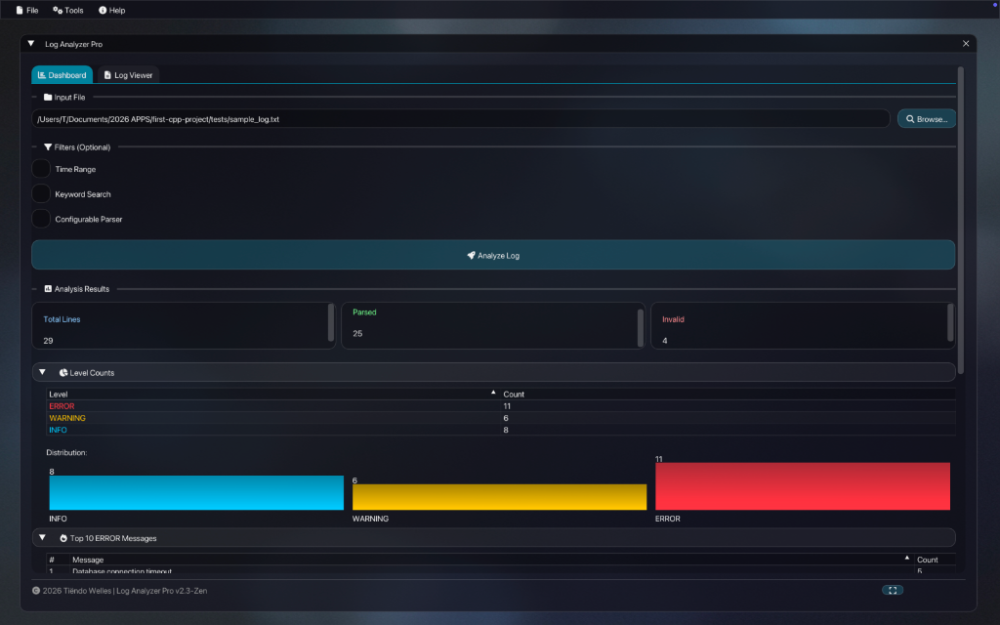
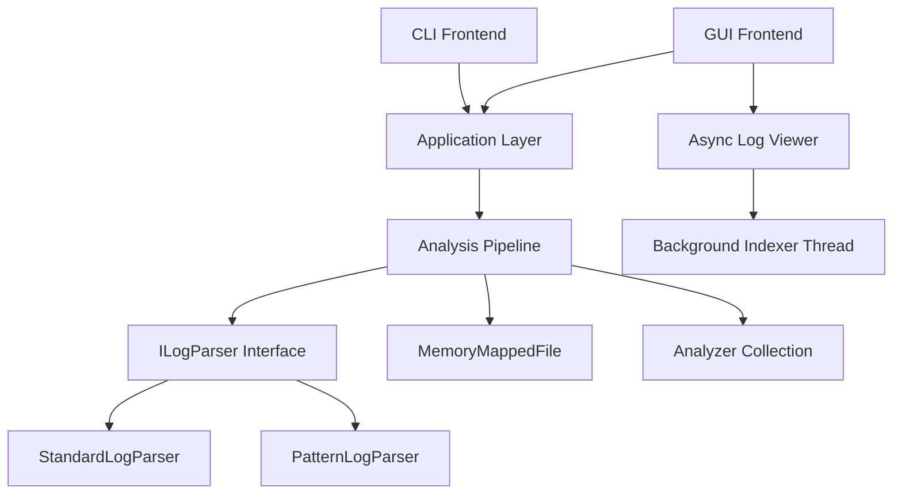

# ⚡ High-Performance Streaming Log Analyzer (C++20)



Een productie-waardige, streaming log analyse engine gebouwd met **modern C++20** en een verbluffende **Glassmorphism ImGui frontend**. Ontworpen voor hoge doorvoer, lage latency en een premium gebruikerservaring.


## 🎯 Project Doelen & Filosofie
Dit project dient als een **Core Infrastructure Portfolio Piece**, en demonstreert:
*   **Zero-Copy Architectuur**: Uitgebreid gebruik van `std::string_view` om heap allocaties te minimaliseren.
*   **Streaming Pipeline**: Verwerkt logs regel-voor-regel met `O(1)` geheugen, ongeacht de bestandsgrootte.
*   **Async Indexing**: Achtergrond threading voor 10GB+ bestanden zonder UI freeze.
*   **Configureerbare Parsing**: Regex-based pattern matching voor elk willekeurig logformaat.
*   **State-of-the-Art UI**: Een volledig op maat gemaakte OpenGL renderer met **Glassmorphism**, animaties en responsieve interacties.
*   **Moderne Tooling**: C++20 features (Concepts, Format), Catch2 v3 voor testing, en CMake build systeem.

## ✨ Belangrijkste Kenmerken

### Core Engine (C++20)
*   **High-Performance Parsing**: Custom parser verwerkt **~2 miljoen regels/sec**.
*   **Configureerbare Parser**: `PatternLogParser` met regex-based custom formats (bijv. `[%D %T] [%L] %M`).
*   **Advanced Memory Management**: `MemoryMappedFile` voor razendsnelle I/O zonder buffers te kopiëren.
*   **Async Indexing**: Dedicated worker thread voor line offset berekening (10GB+ support).
*   **Smart Memory Allocation**: Pre-allocatie gebaseerd op `fileSize / 120` heuristiek.
*   **Pluggable Analyzers**: Modulaire architectuur voor `LevelCount`, `KeywordSearch` en `TopError` analyses.

### Premium GUI (Glassmorphism)
*   **Zen Theme**: Een rustgevende, geanimeerde achtergrond met subtiele parallax effecten.
*   **Polished Visuals**:
    *   **Glass Cards**: Semi-transparante panelen met frosty borders.
    *   **Vector Icons**: Volledige integratie van Font Awesome 6.
    *   **Gradient Charts**: Prachtige datavisualisaties met kleurverlopen.
    *   **Timeline & Heatmap**: Interactieve visualisaties voor log patronen.
*   **Advanced Features**:
    *   **Log Viewer**: Memory-mapped viewer met `ImGuiListClipper` voor miljoenen regels.
    *   **Progress Indicators**: Real-time voortgang tijdens async indexing.
    *   **Parser Configuration**: UI voor custom log format patterns.
*   **Window Management**: Minimaliseren, inklappen en een slimme **Fill Screen / Restore** modus.

## 📊 Performance Benchmark
Verwerking van een gegenereerd logbestand met **1,000,000 regels** (ongeveer 100MB):

| Metriek | Resultaat |
|--------|--------|
| **Executietijd** | **0.52s** |
| **Doorvoer** | **~1.92M regels/sec** |
| **Geheugengebruik** | **< 10MB** (constant) |
| **Max File Size** | **10GB+** (met async indexing) |
| **Platform** | macOS M1, Single Thread |

## 🏗 Architectuur



### Parser Architectuur
De parser engine gebruikt een **Strategy Pattern** met polymorfisme:
- **`ILogParser`**: Pure virtual interface voor alle parsers
- **`StandardLogParser`**: Geoptimaliseerde parser voor standaard formaten
- **`PatternLogParser`**: Regex-based parser voor custom formats met tokens (`%D`, `%T`, `%L`, `%M`)

## 🚀 Quick Start

### Vereisten
*   C++20 compliant compiler (Clang 10+ / GCC 10+ / MSVC 19.28+)
*   CMake (3.14+)
*   GLFW (voor GUI)
*   OpenGL 3.3+

### Build & Run
```bash
# Clone
git clone https://github.com/parvenuprompting/log-analyzer.git
cd log-analyzer

# Configure & Build
mkdir build && cd build
cmake ..
make

# Run GUI
open log_analyzer_gui.app  # macOS
# of
./log_analyzer_gui          # Linux/Windows
```

### vcpkg Dependency Management (Optioneel)
```bash
# Installeer vcpkg
git clone https://github.com/microsoft/vcpkg.git
./vcpkg/bootstrap-vcpkg.sh

# Build met vcpkg
export VCPKG_ROOT=/path/to/vcpkg
mkdir build && cd build
cmake ..
make
```

## 🛠 Ontwerpkeuzes

### 1. `std::string_view` & Memory Mapping
Door gebruik te maken van memory mapping, wordt het bestand direct in het virtuele geheugen geladen. `std::string_view` slice't hierin zonder ooit data te kopiëren. Dit resulteert in zero-copy parsing van disk tot analyse.

### 2. Async Indexing voor Grote Bestanden
Voor bestanden van 10GB+ wordt de line offset berekening uitgevoerd in een dedicated worker thread:
- **Main Thread**: Rendert UI met progress indicator
- **Worker Thread**: Scant bestand voor `\n` characters en bouwt `lineOffsets_` vector
- **Synchronisatie**: `std::mutex` voor thread-safe swap van resultaten

### 3. Configureerbare Parser met Regex
De `PatternLogParser` converteert user-friendly tokens naar regex patterns:
```cpp
Pattern: "[%D %T] [%L] %M"
Regex:   "\[(\d{4}-\d{2}-\d{2}) (\d{2}:\d{2}:\d{2})\] \[(\w+)\] (.*)"
```

### 4. Custom OpenGL Renderer
In plaats van standaard ImGui styles, gebruikt dit project een custom render loop met `stb_image` voor textures en shader-achtige logica voor de achtergrond animaties, wat bewijst dat C++ apps er net zo modern uit kunnen zien als web apps.

## 📦 Project Structuur
```
log-analyzer/
├── core/              # Parsing engine & data structures
│   ├── ILogParser.h
│   ├── StandardLogParser.cpp
│   └── PatternLogParser.cpp
├── analysis/          # Analysis pipeline & algorithms
├── gui/               # ImGui frontend
│   ├── GuiController.cpp
│   ├── LogViewer.cpp
│   └── main_gui.cpp
├── io/                # Memory-mapped file I/O
├── resources/         # Assets (icons, backgrounds, fonts)
├── tests/             # Catch2 unit tests
└── vcpkg.json         # Dependency manifest
```

## 🧪 Testing
```bash
# Run unit tests
cd build
./unit_tests

# Run specific test suite
./unit_tests "[Pattern]"  # Test PatternLogParser
./unit_tests "[Parser]"   # Test StandardLogParser
```

## 🎨 UI Features

### Dashboard Tab
- File input met browse functie
- Filters (Time Range, Keyword Search, Custom Parser)
- Analysis results met grafieken
- Timeline visualisatie (minute-by-minute)
- Heatmap (24x7 error density)

### Log Viewer Tab
- Memory-mapped file viewing
- Async indexing met progress bar
- Syntax highlighting voor log levels
- `ImGuiListClipper` voor miljoenen regels
- Zero-copy rendering

## 🔧 Configuratie

### Custom Log Formats
In de GUI kun je custom log formats definiëren:
1. Enable "Configurable Parser" checkbox
2. Voer pattern in (bijv. `%T - %L - %M`)
3. Ondersteunde tokens:
   - `%D`: Date (YYYY-MM-DD)
   - `%T`: Time (HH:MM:SS)
   - `%L`: Level (INFO, ERROR, WARNING)
   - `%M`: Message (rest van de regel)

## 📈 Roadmap

### Phase 3: Cross-Platform Professionalization (In Progress)
- [ ] vcpkg integratie voor dependency management
- [ ] Multi-platform CMake (Windows, Linux, macOS)
- [ ] GitHub Actions CI/CD pipeline
- [ ] Platform-specific optimalisaties

### Phase 4: Advanced Features
- [ ] Real-time log streaming
- [ ] Distributed log aggregation
- [ ] Machine learning anomaly detection
- [ ] Export naar JSON/CSV/PDF

## 👥 Auteur
**Tiëndo Welles**  
*High-Performance C++ Portfolio Project*

## 📄 Licentie
MIT License - zie [LICENSE](LICENSE) voor details
