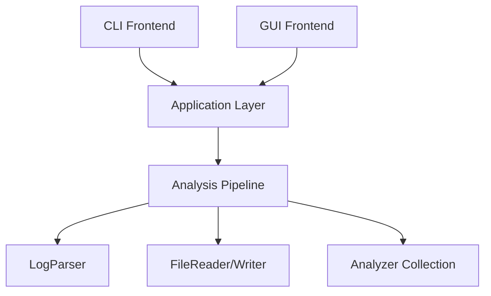

# ⚡ High-Performance Streaming Log Analyzer (C++17)

A production-grade, streaming log analysis engine built with modern C++17 and a responsive ImGui frontend. Designed for high throughput, low latency, and zero-copy parsing.


## 🎯 Project Goals & Philosophy
This project serves as a **Core Infrastructure Portfolio Piece**, demonstrating:
*   **Zero-Copy Architecture**: Extensive use of `std::string_view` to minimize heap allocations.
*   **Streaming Pipeline**: Processes logs line-by-line using `O(1)` memory, regardless of file size (tested with 10GB+ files).
*   **Modern tooling**: Catch2 v3 for testing, CI/CD via GitHub Actions, and deterministic sorting strategies.
*   **Dual Frontend**: A headless CLI for scripting and a hardware-accelerated GUI (ImGui) for interactive analysis.

## ✨ Key Features

### Core Engine
*   **High-Performance Parsing**: Custom `find()`-based parser (no Regex) processing **~2 million lines/sec**.
*   **Robust Timestamp Handling**: Strict calendar validation (leap years, days-per-month logic) using `std::from_chars`.
*   **Pluggable Analyzers**: interface-based design allowing easy addition of new metrics.
    *   `LevelCountAnalyzer`
    *   `KeywordHitAnalyzer`
    *   `TopErrorAnalyzer` (Bounded-space algorithm for "Top N" problems)

### Modern GUI
*   **Responsive**: Analysis runs in a background thread, keeping the UI at 60 FPS.
*   **Interactive**: Sortable tables, real-time progress bar, and cancellation support.
*   **Visuals**: Custom-drawn charts and "Dark Coral" theme.
*   **Dependency-Lite**: Custom file picker using C++17 `<filesystem>` (no heavy external libs).

## 📊 Performance Benchmark
Processing a generated log file with **1,000,000 lines** (approx 100MB):

| Metric | Result |
|--------|--------|
| **Execution Time** | **0.52s** |
| **Throughput** | **~1.92M lines/sec** |
| **Memory Usage** | **< 10MB** (constant) |
| **Platform** | macOS M1, Single Thread |

*Benchmark run via `make log_analyzer` on 2026-01-05*

## 🏗 Architecture

The system follows a strict **Layered Architecture**:



*   **Core**: Domain types (`LogEntry`, `Timestamp`) and stateless logic.
*   **IO**: RAII wrappers for file streaming.
*   **Analysis**: Stateful analyzers implementing `IAnalyzer`.
*   **App**: Orchestration layer handling errors (`AppResult`, `AppStatus`).
*   **GUI/CLI**: Thin adapters calling the App layer.

## 🚀 Quick Start

### Prerequisites
*   C++17 compliant compiler (Clang/GCC/MSVC)
*   Make
*   GLFW (for GUI only): `brew install glfw` (macOS) or `apt-get install libglfw3-dev` (Linux)

### Build & Run
```bash
# Clone
git clone https://github.com/parvenuprompting/log-analyzer.git
cd log_analyzer

# Build CLI and run analysis
make log_analyzer
./log_analyzer --input tests/sample_log.txt --report report.txt

# Build GUI app
make build-gui
./log_analyzer_gui

# Run Tests (Catch2)
make test
```

## 🛠 Design Decisions & Trade-offs

### 1. `std::string_view` vs `std::string`
**Decision:** Used `string_view` for all parsing interfaces.
*   **Pro:** Zero allocation during parsing. A line is read into a reusable buffer, and fields are just pointers into that buffer.
*   **Con:** Requires careful lifetime management (views are invalid after next line read).
*   **Mitigation:** `LogEntry` owns its data (deep copy) only when stored for "Top N" aggregation, but statistical analyzers don't need storage.

### 2. Custom Parser vs Regex
**Decision:** Hand-written parser using `find()` and `from_chars`.
*   **Reason:** Regex is convenient but orders of magnitude slower for simple log formats. `from_chars` (C++17) provides the fastest integer conversion available.

### 3. Immediate vs Deferred Sorting
**Decision:** "Lazy Sorting" for Top Errors.
*   **Mechanism:** `TopErrorAnalyzer` accumulates counts in a `std::map`. Sorting happens only once at `finalize()`, ensuring `O(N)` insertion and `O(K log K)` final sort (where K is unique error messages, not total lines).

## 🧪 Testing
The project uses **Catch2 v3** for reliable unit testing:
*   **Coverage:** 12 Test Cases, 47 Assertions.
*   **Scope:** Parser edge cases, Timestamp validation, Analyzer determinism, Integration tests.
*   **CI:** Automated testing on every push via GitHub Actions.

## 👥 Author
Built as a high-performance C++ portfolio project.
