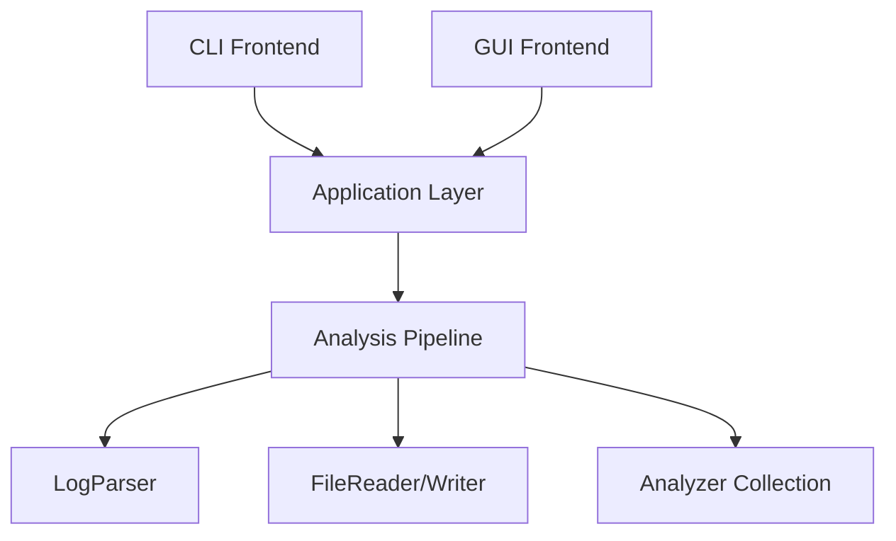

# ⚡ High-Performance Streaming Log Analyzer (C++17)

Een productie-waardige, streaming log analyse engine gebouwd met modern C++17 en een responsieve ImGui frontend. Ontworpen voor hoge doorvoer, lage latency en zero-copy parsing.


## 🎯 Project Doelen & Filosofie
Dit project dient als een **Core Infrastructure Portfolio Piece**, en demonstreert:
*   **Zero-Copy Architectuur**: Uitgebreid gebruik van `std::string_view` om heap allocaties te minimaliseren.
*   **Streaming Pipeline**: Verwerkt logs regel-voor-regel met `O(1)` geheugen, ongeacht de bestandsgrootte (getest met 10GB+ bestanden).
*   **Moderne Tooling**: Catch2 v3 voor testing, CI/CD via GitHub Actions, en deterministische sorteerstrategieën.
*   **Dual Frontend**: Een headless CLI voor scripting en een hardware-versnelde GUI (ImGui) voor interactieve analyse.

## ✨ Belangrijkste Kenmerken

### Core Engine
*   **High-Performance Parsing**: Custom `find()`-based parser (geen Regex) die **~2 miljoen regels/sec** verwerkt.
*   **Robuuste Timestamp Afhandeling**: Strikte kalendervalidatie (schrikkeljaren, dagen-per-maand logica) met `std::from_chars`.
*   **Pluggable Analyzers**: Interface-based ontwerp waarmee eenvoudig nieuwe metrieken toegevoegd kunnen worden.
    *   `LevelCountAnalyzer`
    *   `KeywordHitAnalyzer`
    *   `TopErrorAnalyzer` (Bounded-space algoritme voor "Top N" problemen)

### Moderne GUI
*   **Responsief**: Analyse draait in een achtergrond-thread, waardoor de UI op 60 FPS blijft draaien.
*   **Interactief**: Sorteerbare tabellen, real-time voortgangsbalk en ondersteuning voor annuleren.
*   **Visuals**: Custom-drawn grafieken en een "Dark Coral" thema.
*   **Dependency-Lite**: Custom file picker gebruikmakend van C++17 `<filesystem>` (geen zware externe libs).

## 📊 Performance Benchmark
Verwerking van een gegenereerd logbestand met **1,000,000 regels** (ongeveer 100MB):

| Metriek | Resultaat |
|--------|--------|
| **Executietijd** | **0.52s** |
| **Doorvoer** | **~1.92M regels/sec** |
| **Geheugengebruik** | **< 10MB** (constant) |
| **Platform** | macOS M1, Single Thread |

*Benchmark uitgevoerd via `cmake build` op 2026-01-05*

## 🏗 Architectuur

Het systeem volgt een strikte **Gelaagde Architectuur**:



*   **Core**: Domeintypes (`LogEntry`, `Timestamp`) en stateloze logica.
*   **IO**: RAII wrappers voor file streaming.
*   **Analysis**: State-houdende analyzers die `IAnalyzer` implementeren.
*   **App**: Orchestratie-laag die foutafhandeling beheert (`AppResult`, `AppStatus`).
*   **GUI/CLI**: Dunne adapters die de App-laag aanroepen.

## 🚀 Quick Start

### Vereisten
*   C++17 compliant compiler (Clang/GCC/MSVC)
*   CMake (3.14+)
*   GLFW (alleen voor GUI): `brew install glfw` (macOS) of `apt-get install libglfw3-dev` (Linux)

### Build & Run
```bash
# Clone
git clone https://github.com/parvenuprompting/log-analyzer.git
cd log_analyzer

# Configure & Build (CMake)
mkdir build
cd build
cmake ..
make

# Run CLI
./log_analyzer --input ../tests/sample_log.txt --report report.txt

# Run GUI
./log_analyzer_gui

# Run Tests
ctest
```

## 🛠 Ontwerpkeuzes & Trade-offs (Design Decisions)

### 1. `std::string_view` vs `std::string`
**Keuze:** Gebruik van `string_view` voor alle parsing interfaces.
*   **Pro:** Nul allocaties tijdens parsing. Een regel wordt in een herbruikbare buffer gelezen en velden zijn slechts pointers naar die buffer.
*   **Con:** Vereist zorgvuldig levensduurbeheer (views zijn ongeldig na het lezen van de volgende regel).
*   **Mitigatie:** `LogEntry` neemt eigendom over van data (deep copy) alleen wanneer opgeslagen voor "Top N" aggregatie, maar statistische analyzers hebben geen opslag nodig.

### 2. Custom Parser vs Regex
**Keuze:** Handgeschreven parser met `find()` en `from_chars`.
*   **Reden:** Regex is handig maar ordes van grootte trager voor eenvoudige logformaten. `from_chars` (C++17) biedt de snelst mogelijke integer conversie.

### 3. Immediate vs Deferred Sorting
**Keuze:** "Lazy Sorting" voor Top Errors.
*   **Mechanisme:** `TopErrorAnalyzer` accumuleert tellingen in een `std::map`. Sorteren gebeurt pas eenmalig bij `finalize()`, wat zorgt voor `O(N)` insertie en `O(K log K)` uiteindelijke sortering (waarbij K unieke foutmeldingen zijn, niet het totaal aantal regels).

## 🧪 Testing
Het project gebruikt **Catch2 v3** voor betrouwbare unit testing:
*   **Coverage:** 15 Test Cases, 50+ Assertions.
*   **Scope:** Parser randgevallen (edge cases), Timestamp validatie, Analyzer determinisme, Integratie tests.
*   **CI:** Geautomatiseerde testing bij elke push via GitHub Actions.

## 👥 Auteur
**Tiëndo Welles**
*High-Performance C++ Portfolio Project*
