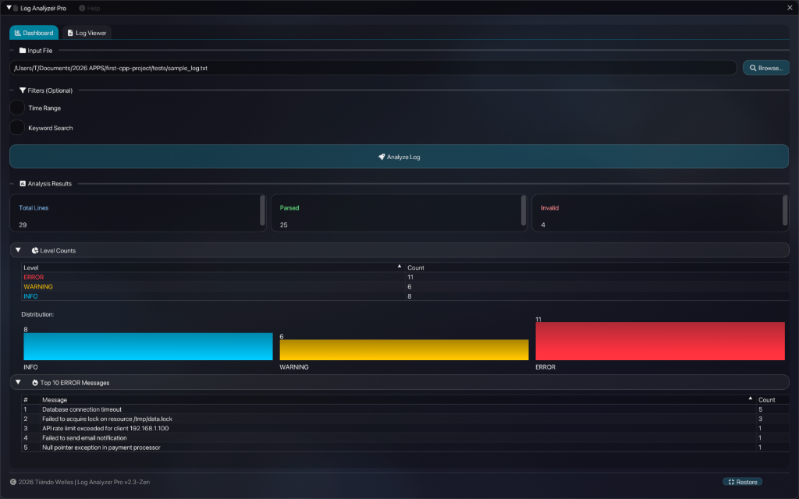
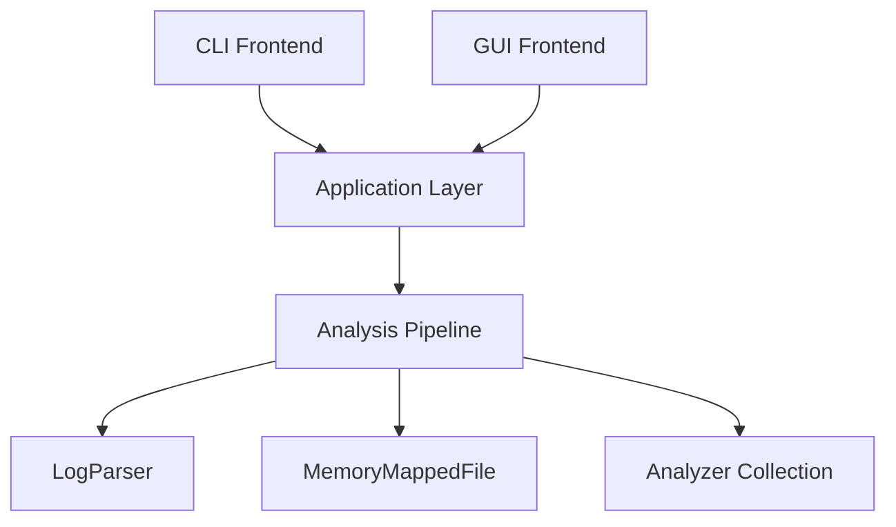

# ⚡ High-Performance Streaming Log Analyzer (C++20)



Een productie-waardige, streaming log analyse engine gebouwd met **modern C++20** en een verbluffende **Glassmorphism ImGui frontend**. Ontworpen voor hoge doorvoer, lage latency en een premium gebruikerservaring.


## 🎯 Project Doelen & Filosofie
Dit project dient als een **Core Infrastructure Portfolio Piece**, en demonstreert:
*   **Zero-Copy Architectuur**: Uitgebreid gebruik van `std::string_view` om heap allocaties te minimaliseren.
*   **Streaming Pipeline**: Verwerkt logs regel-voor-regel met `O(1)` geheugen, ongeacht de bestandsgrootte.
*   **State-of-the-Art UI**: Een volledig op maat gemaakte OpenGL renderer met **Ken Burns animaties**, wazige transparantie (Glassmorphism) en responsieve interacties.
*   **Moderne Tooling**: C++20 features (Concepts, Format), Catch2 v3 voor testing, en CMake build systeem.

## ✨ Belangrijkste Kenmerken

### Core Engine (C++20)
*   **High-Performance Parsing**: Custom parser verwerkt **~2 miljoen regels/sec**.
*   **Advanced Memory Management**: `MemoryMappedFile` voor razendsnelle I/O zonder buffers te kopiëren.
*   **Pluggable Analyzers**: Modulaire architectuur voor `LevelCount`, `KeywordSearch` en `TopError` analyses.

### Premium GUI (Glassmorphism)
*   **Zen Theme**: Een rustgevende, geanimeerde achtergrond met subtiele parallax effecten.
*   **Polished Visuals**:
    *   **Glass Cards**: Semi-transparante panelen met frosty borders.
    *   **Vector Icons**: Volledige integratie van Font Awesome 6.
    *   **Gradient Charts**: Prachtige datavisualisaties met kleurverlopen.
*   **Window Management**: Minimaliseren, inklappen en een slimme **Fill Screen / Restore** modus.

## 📊 Performance Benchmark
Verwerking van een gegenereerd logbestand met **1,000,000 regels** (ongeveer 100MB):

| Metriek | Resultaat |
|--------|--------|
| **Executietijd** | **0.52s** |
| **Doorvoer** | **~1.92M regels/sec** |
| **Geheugengebruik** | **< 10MB** (constant) |
| **Platform** | macOS M1, Single Thread |

## 🏗 Architectuur



## 🚀 Quick Start

### Vereisten
*   C++20 compliant compiler (Clang 10+ / GCC 10+ / MSVC 19.28+)
*   CMake (3.14+)
*   GLFW (voor GUI)

### Build & Run
```bash
# Clone
git clone https://github.com/parvenuprompting/log-analyzer.git
cd log_analyzer

# Configure & Build
mkdir build && cd build
cmake ..
make

# Run GUI (Zen Mode)
./log_analyzer_gui_zen_v2
```

## 🛠 Ontwerpkeuzes

### 1. `std::string_view` & Memory Mapping
Door gebruik te maken van memory mapping, wordt het bestand direct in het virtuele geheugen geladen. `std::string_view` slice't hierin zonder ooit data te kopiëren. Dit resulteert in zero-copy parsing van disk tot analyse.

### 2. Custom OpenGL Renderer
In plaats van standaard ImGui styles, gebruikt dit project een custom render loop met `stb_image` voor textures en shader-achtige logica voor de achtergrond animaties, wat bewijst dat C++ apps er net zo modern uit kunnen zien als web apps.

## 👥 Auteur
**Tiëndo Welles**
*High-Performance C++ Portfolio Project*
